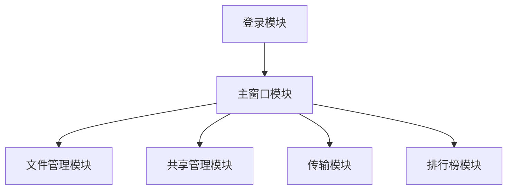

# YunDisk - 分布式文件系统

YunDisk是一个基于Qt开发的跨平台云盘系统客户端，提供文件存储、共享、传输等功能。

## 功能特点

### 🔐 用户管理
- 用户注册与登录
- 安全的密码加密存储
- 用户信息管理
- 登录状态记忆功能

### 📁 文件管理
- 文件上传与下载
- 文件列表显示
- 文件类型识别
- 文件搜索功能
- 支持大文件传输
- MD5文件校验

### 🔄 传输管理
- 传输队列管理
- 断点续传支持
- 传输进度显示
- 传输速度控制
- 传输历史记录

### 📊 数据统计
- 文件下载排行榜
- 用户活跃度统计
- 存储空间统计
- 传输速度统计

### 🤝 文件共享
- 文件分享功能
- 共享链接生成
- 共享权限管理
- 共享历史记录

## 技术架构

### 客户端架构
- **UI层**：基于Qt的用户界面
- **业务层**：核心业务逻辑处理
- **网络层**：基于HTTP的网络通信
- **存储层**：本地配置和缓存管理

### 核心模块


## 开发环境

- Qt 5.12.8
- C++11
- GCC 64bit
- 操作系统：支持 Windows/Linux/MacOS

## 项目结构

```
YunDisk/
├── conf/                # 配置文件目录
├── common/             # 公共功能模块
├── controls/           # 自定义控件
├── images/             # 图片资源
├── selfwidget/         # 自定义窗口组件
├── main.cpp            # 程序入口
├── login.cpp/h         # 登录模块
├── mainwindow.cpp/h    # 主窗口模块
├── myfilewg.cpp/h      # 文件管理模块
├── transfer.cpp/h      # 传输模块
├── sharelist.cpp/h     # 共享列表模块
└── rankinglist.cpp/h   # 排行榜模块
```

## 快速开始

### 环境配置
1. 安装Qt 5.12.8或更高版本
2. 安装相应的编译器（GCC/MSVC）
3. 克隆项目代码

```bash
git clone https://github.com/yourusername/YunDisk.git
cd YunDisk
```

### 编译运行
```bash
# Linux/MacOS
qmake YunDisk.pro
make

# Windows
qmake YunDisk.pro
nmake # 或 mingw32-make
```

### 配置文件
在 `conf/cfg.json` 中配置服务器地址和端口：
```json
{
    "server": {
        "ip": "your_server_ip",
        "port": "your_server_port"
    }
}
```

## 使用说明

### 用户注册/登录
1. 启动程序，进入登录界面
2. 新用户点击"注册"按钮进行注册
3. 输入用户名和密码登录系统

### 文件操作
1. 点击"上传文件"进行文件上传
2. 在文件列表中选择文件进行下载
3. 右键文件可进行共享设置

### 传输管理
1. 点击"传输列表"查看当前传输状态
2. 可暂停/继续/取消传输任务
3. 查看传输历史记录

## 安全说明

- 用户密码使用MD5加密存储
- 文件传输使用MD5校验
- 支持HTTPS安全传输
- 敏感信息加密存储

## 性能优化

- 文件分片上传
- 传输队列管理
- 本地缓存机制
- 异步网络请求

## 贡献指南

1. Fork 本仓库
2. 创建新的分支 `git checkout -b feature/your-feature`
3. 提交更改 `git commit -m 'Add some feature'`
4. 推送到分支 `git push origin feature/your-feature`
5. 提交 Pull Request

## 版本历史

- v1.0.0 (2024-02-21)
  - 基础功能实现
  - 文件上传下载
  - 用户管理系统

## 待办事项

- [ ] 添加文件预览功能
- [ ] 优化传输速度
- [ ] 添加文件版本控制
- [ ] 实现离线下载功能
- [ ] 添加文件加密功能

## 许可证

本项目采用 MIT 许可证 - 查看 [LICENSE](LICENSE) 文件了解详细信息

## 联系方式

- 项目维护者：[Your Name]
- 邮箱：[your.email@example.com]
- 项目主页：[https://github.com/yourusername/YunDisk]

## 致谢

感谢所有为本项目做出贡献的开发者！
